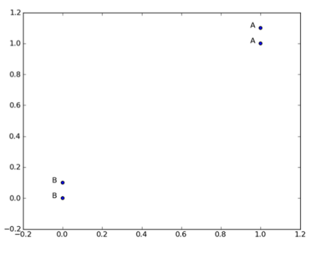

#kNN

L'algorithme kNN pour k-nearest neighbors ou k plus proches voisins est l'un des algorithmes les plus utilisés en Machine Learning.
Ceci est une implémentation de cet algorithme des plus basiques en classification.

##Problème
On dispose d'un ensemble de points représentés dans un repère grâce à leurs coordonnées(x, y). À chaque point on associe un label précis 'A' ou 'B'.
La figure ci-dessous illustre le sujet.



Le but est de "prédire" si un quelconque point X appartient à la catégorie 'A' ou la catégorie 'B'. kNN est un algorithme qui nous 
permet d'effectuer ce type de classification plutôt simple.

##Principe de kNN

* On possède un ensemble de données de départ (training set) ayant chacun un label. Ex: (0, 0) -> 'A'
* On dispose d'un ensemble de données (data set) que l'on cherche à classer dans une des catégories.
* Pour chaque élément du data set, on calcule "la distance" entre celui et chaque point du training set
*	On classe les distances par ordre croissant
*	On choisit les k premiers éléments par ordre de distances
*	On choisit donc le label dominant parmi les k éléments, ce qui représente la catégorie de l'élément du data set


##Utilisation

```
from kNN import *

dataSet = createDataSet()

k = 3

point = Point(0.0, 0.0)

kNN(dataSet, k, point)

```


##Licence
[MIT License](https://opensource.org/licenses/MIT)

##A propos
Junior Gantin, Machine Learning Enthusiast
@nioperas06